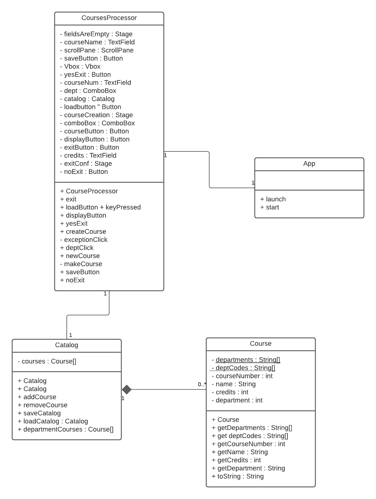

This is the class diagram. I left myself far too little time to flesh everything out, but I was trying to implement the MVC design pattern. The model is the catalog and course, the controller is the coursesProcessor, and the view is the fxml that is run through App.

.png)

There isn't much thought behind this design. I was trying to get this done as fast as possible.